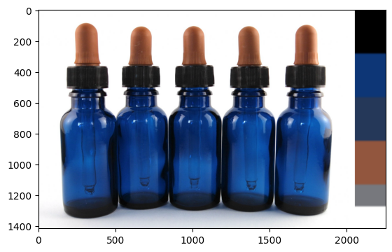
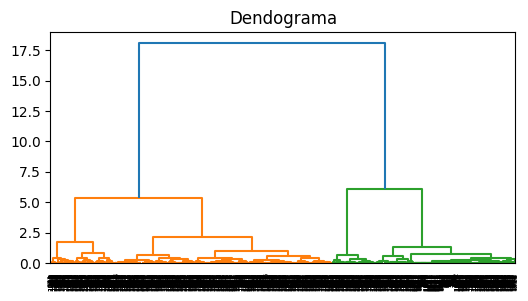
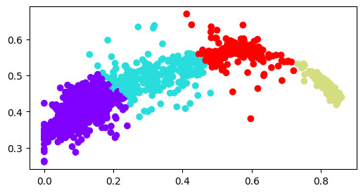

# Paleta de Colores con Agglomerative Cluster Python

Es común ver imágenes cinematográficas acompañadas de la paleta de colores que se empleó, pero ¿cómo podemos obtener los colores que componen una imagen usando herramientas de análisis no supervisado con Python?

# Librerías
-scipy.cluster.hierarchy
-numpy
-matplotlib
-cv2
-pandas

# Proceso
En este proyecto se toma una imagen relativamente básica y se lleva a cabo un preprocesamiento, extrayendo los pixeles que son puramente blanco y negro, luego se normalizan los datos y después, con scipy.cluster.hierarchy investigar la cantidad óptima de grupos en los que se pueden clasificar los colores de la imagen. 

Como paso final, se entrena el modelo de  Agglomerative Cluster, con una muestra aleatoria de los pixeles y finalmente se obtiene el centroide de los grupos, para exponer cada uno de los colores representativos del grupo junto con la nueva imagen. 

# Fuentes

- https://scipy.org/
- https://scikit-learn.org/stable/modules/clustering.html
